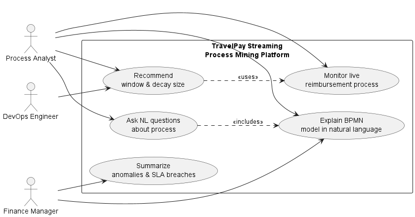
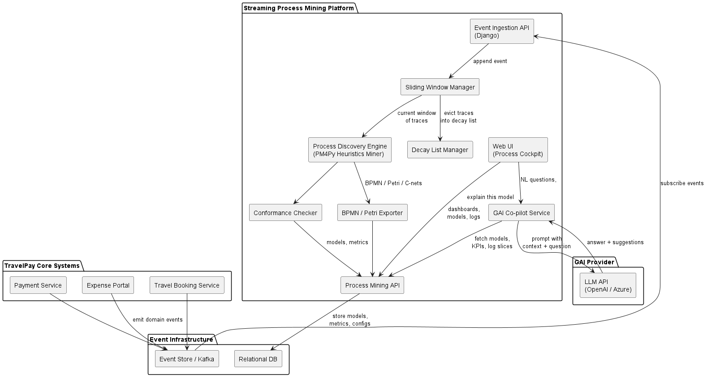
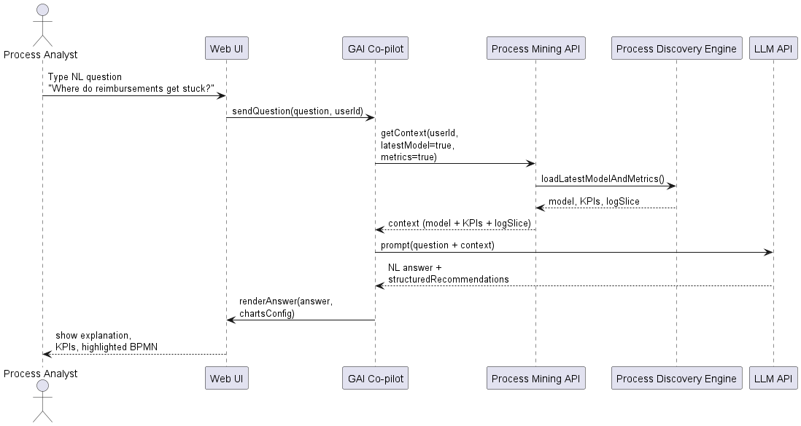
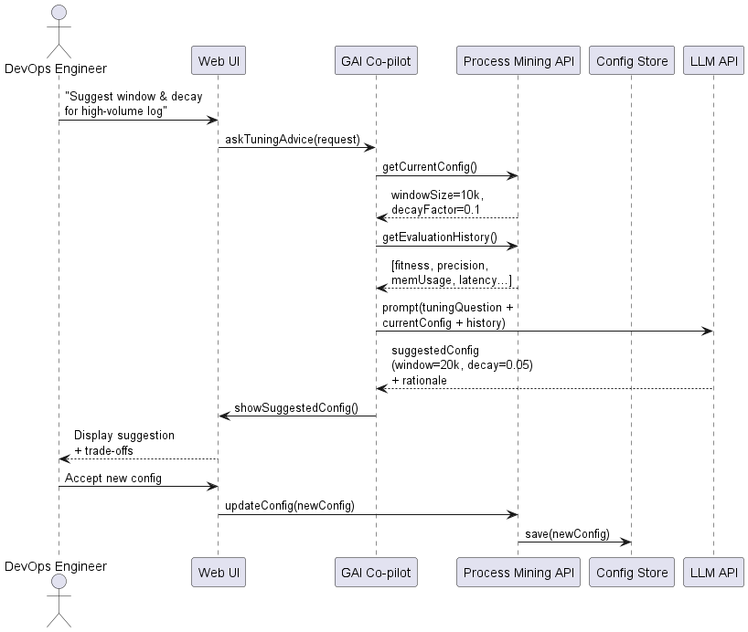

# Diagram Descriptions

A company that provides an end-to-end solution for managing corporate travel and employee expense reimbursement. The streaming 
process-mining engine gives this company real-time visibility into how their internal processes actually operate, highlighting 
inefficiencies and deviations. With the addition of GAI, teams gain intuitive explanations and smart optimization suggestions
that support faster, data-driven improvements.

## 1. Use-Case Diagram Description

The use-case diagram models how different stakeholders interact with the **Streaming Process Mining Platform**, including modules enhanced with generative AI (GAI). The platform supports three main user groups:

### **Process Analyst**
- Monitors the live reimbursement and travel-expense processes.
- Asks natural-language questions about process performance, bottlenecks, deviations, and SLA breaches.
- Requests readable explanations of automatically discovered BPMN or Petri-net models.
- Uses GAI to obtain recommendations for tuning parameters such as sliding window size and decay factor.
 
### **Finance Manager**
- Receives summarized anomaly reports and SLA violation notifications.
- Uses natural-language explanations to understand discovered processes without needing technical expertise.

### **DevOps Engineer**
- Manages operational configuration of the streaming miner.
- Requests GAI recommendations for tuning streaming parameters based on performance metrics.

The diagram emphasizes that GAI extends traditional process-mining capabilities by enabling natural-language interaction and intelligent configuration support.

---

## 2. Component Diagram Description

The component diagram illustrates the architecture of the process-mining ecosystem and shows how the thesis prototype integrates within it. It includes four major areas:

### **Core Systems**
These operational systems generate the event data used in process mining:
- Expense Portal
- Travel Booking Service
- Payment Service

They emit domain events such as travel approvals, expense submissions, or payments.

### **Event Infrastructure**
- **Event Store / Kafka** receives events from the core systems.
- **Relational database** stores discovered models, evaluation metrics, and configurations.

### **Streaming Process Mining Platform**
This subsystem includes:
- **Event Ingestion API (Django)** – subscribes to event streams and normalizes events into XES-like format.
- **Sliding Window Manager** – maintains a window of recent traces.
- **Decay List Manager** – reduces influence of older traces via exponential decay.
- **Process Discovery Engine (PM4Py)** – performs incremental Heuristics Miner discovery.
- **Conformance Checker** – calculates fitness, precision, and deviations.
- **Model Exporter** – outputs BPMN, Petri nets, or C-nets.
- **Process Mining API** – exposes models, KPIs, and historical metrics.
- **Web UI** – interface for analysts and managers.
- **GAI Co-pilot** – integrates the system with LLM capabilities for explanation and analysis.

### **GAI Provider**
- The **LLM API (OpenAI/Azure)** processes prompts and returns explanations, suggestions, and rewritten model descriptions.

This architecture highlights that the thesis’ streaming mining logic remains deterministic, while GAI enhances interpretability and accessibility.

---

## 3. Sequence Diagram: Analyst Asking a Question (NLQ Flow)

This sequence diagram shows how a Process Analyst uses natural language to explore process performance (e.g., “Where do reimbursements get stuck?”).

### **Flow Description**
1. The analyst submits a natural-language question via the Web UI.
2. The request is forwarded to the **GAI Co-pilot**.
3. The GAI Co-pilot requests contextual data from the **Process Mining API**, including:
    - Latest discovered model,
    - KPIs such as throughput times and SLA breaches,
    - Relevant log excerpts.
4. The Process Discovery Engine provides the model and metrics to the API.
5. The GAI Co-pilot combines the user question with retrieved context to form a structured prompt.
6. The prompt is sent to the external **LLM API**.
7. The LLM returns a natural-language answer and optional recommendations.
8. The Web UI displays the explanation, highlighted model elements, and supporting KPIs.

This flow demonstrates how natural-language exploration simplifies interaction with complex process models.

---

## 4. Sequence Diagram: Parameter Tuning with GAI (Sliding Window & Decay)

This diagram explains how the DevOps Engineer uses GAI to optimize window size and decay parameters within the streaming miner.

### **Flow Description**
1. The DevOps Engineer requests tuning advice via the Web UI.
2. The Web UI passes the request to the **GAI Co-pilot**.
3. The GAI Co-pilot fetches:
    - Current configuration (window size, decay factor),
    - Historical evaluation metrics (fitness, precision, memory usage, latency).
4. The Process Mining API gathers and returns these values.
5. The GAI Co-pilot constructs a detailed prompt including trade-offs and recent system performance.
6. The prompt is sent to the external **LLM API**.
7. The LLM proposes new values for window size and decay, along with reasoning.
8. The GAI Co-pilot displays the suggestions to the DevOps Engineer.
9. If approved, the updated configuration is saved back into the system via the Process Mining API.

This flow demonstrates how GAI provides explainable recommendations while the system maintains strict control over configuration and operational logic.

